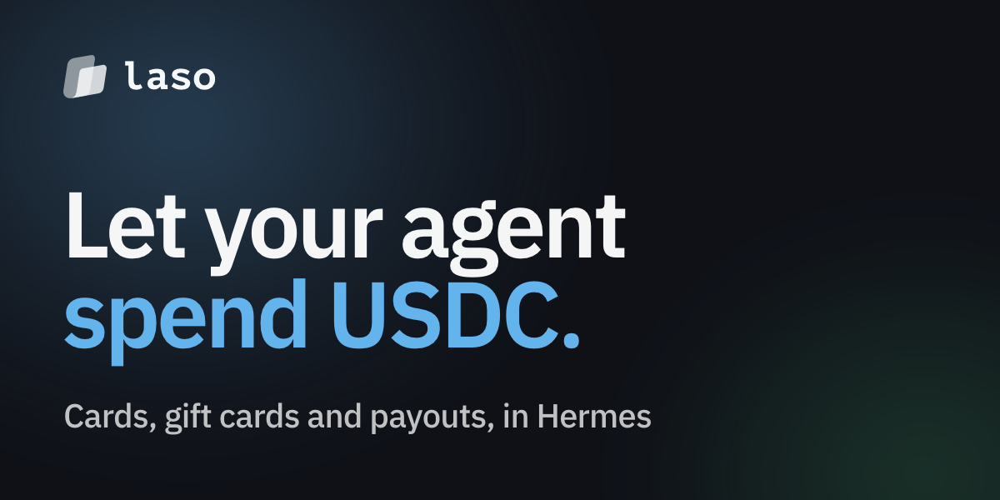

# Laso Finance for Hermes Agent



Give your [Hermes](https://hermes-agent.nousresearch.com) agent a way to spend USDC in the real world: prepaid cards, gift cards, push-to-card, Venmo and PayPal payouts, and bank payments.

The plugin adds the Laso tools to Hermes, each named with a `laso_` prefix. They are the same tools as the [Laso MCP server](https://docs.laso.finance/guides/mcp-server).

## Install

```bash
hermes plugins install LasoFinance/hermes-plugin --enable
```

There is no key to paste. Start a new session and ask your agent to connect to Laso.

## Connect

1. Your agent calls a Laso tool and gets back a link and a short code. It passes both to you.
2. Open the link on any device: your laptop, your phone, wherever you are signed in. Sign in to Laso (or create an account in the same step), check that the code matches, and approve.
3. Tell your agent you approved. Its next Laso call finishes connecting and runs.

This works the same in the terminal, in Hermes Desktop, over SSH, and through the messaging gateway, because nothing needs a browser on the machine Hermes runs on.

The connection is an ordinary Laso API key labelled "Hermes". You can see and revoke it on the [agent dashboard](https://laso.finance/agent/dashboard). If you revoke it, the next Laso call asks you to approve a new connection.

## Approvals

Every tool that moves money or hands out a credential asks you to approve it in Hermes before it runs: ordering cards, buying gift cards, sending payouts, withdrawing, transferring from the agent wallet, paying other x402 endpoints, cancelling orders, deleting saved recipients, and creating API keys. The prompt shows the tool and its arguments, such as the amount and the recipient. Reading balances, card details, and statuses never asks.

If nobody is there to answer (a cron job, an unattended run), the call is blocked by default. Hermes's `approvals.cron_mode` and `approvals.unattended_mode` settings decide this, so a payout job you schedule on purpose can be allowed there.

## Funding

Paid tools (their descriptions say PAID ROUTE) pay their USDC price from your agent's Laso wallet. Ask your agent for its wallet address (`laso_get_agent_wallet`) and send USDC on Solana to it.

## What the plugin does on your machine

- **Network:** every request goes to `https://laso.finance`: tool calls to `/mcp`, and sign-in to `/oauth/device_authorization` and `/oauth/token`. No other hosts.
- **Credentials:** after you approve, the plugin saves the key as `LASO_API_KEY` in `~/.hermes/.env`, the same place Hermes keeps other credentials. While a sign-in is waiting for you, its one-time device code sits in the plugin's own state for up to 10 minutes. The plugin reads no other credentials.
- **Nothing in the background:** no threads, no processes, no shell commands, and no telemetry. Every tool call returns right away, including the ones that are waiting for you to approve.
- **No self-updating:** the tool list is fixed in `tools.json` at each release. Updates arrive only when you run `hermes plugins update laso-finance`.

## Using an existing key

To skip the sign-in, for example on a server you set up by hand, put a key from the [agent dashboard](https://laso.finance/agent/dashboard) in `LASO_API_KEY` (in `~/.hermes/.env`, or the plugin's settings in Hermes Desktop). The plugin uses it as is.

## Updating

```bash
hermes plugins update laso-finance
```

## Development

`tools.json` and `plugin.yaml` are generated from the Laso API contract, so the tools match the MCP server exactly. Tests need no Hermes install and no network:

```bash
python3 -m unittest discover tests
```

## More

- Docs: https://docs.laso.finance
- API contract: https://laso.finance/openapi.json
- Agent skill: https://laso.finance/SKILL.md

This repository is published from the Laso monorepo. Open issues here and we will pick them up.
